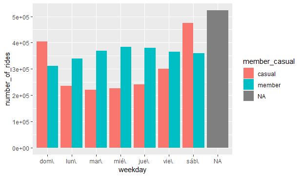
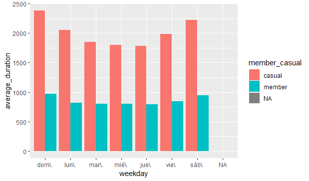

```{r setup, include=FALSE}
knitr::opts_chunk$set(echo = TRUE)
```

## Case Study

Cyclistic bike-share analysis case study! In this case study, i will perform many real-world tasks of a junior data analyst. I will work for a fictional company, Cyclistic, and meet different characters and team members. In order to answer the key business questions, you will follow the steps of the data analysis process: ask, prepare, process, analyze, share, and act. Moreno (director of marketing and my manager) has assigned me the first question to answer: [***How do annual members and casual riders use Cyclistic bikes differently?***]{.ul}

For the analysis use public data for the last 12 months found at: <https://divvy-tripdata.s3.amazonaws.com/index.html.>

# Analysis

For the analysis, I used the RStudio data analysis tool due to the amount of data collected.

##### **Difference between weekday and weekend rides**



##### **Difference between the length of rides**


*Looking at the graphs, it can be seen that occasional users make trips with much longer periods than members (the difference is notorious) and the latter make their trips more frequently on Saturdays and Sundays. As for the members, they use the bicycles more frequently on weekdays (Monday to Friday) and decrease their use on Saturdays and Sundays.*

# Recommendations

The analysis yielded trends in bicycle use by members and casual users, for this reason I propose:

-   Special plans or weekend promotions for casual users.

-   Discounts for longer trip lengths

-   Keeping a record of trips of each user (member or not), to make personalized discounts or promotions.

# **Limitations** 

-   Using Excel for this case was a bit disappointing due to the amount of data, as, Excel would freeze on my pc.

-   I also could not upload the 12 months to Big Query because of the size of some months. (I don't have a premium account)

-   RStudio was giving me a lot of errors, being a bit annoying but motivating. I looked for help in different portals, as the Google data analysis course taught me, managing to solve some important errors for my analysis.

[*I present you my script - Point to my working directory, use databases of months from November 2020 to October 2021. The database was month by month.*]{.ul}
